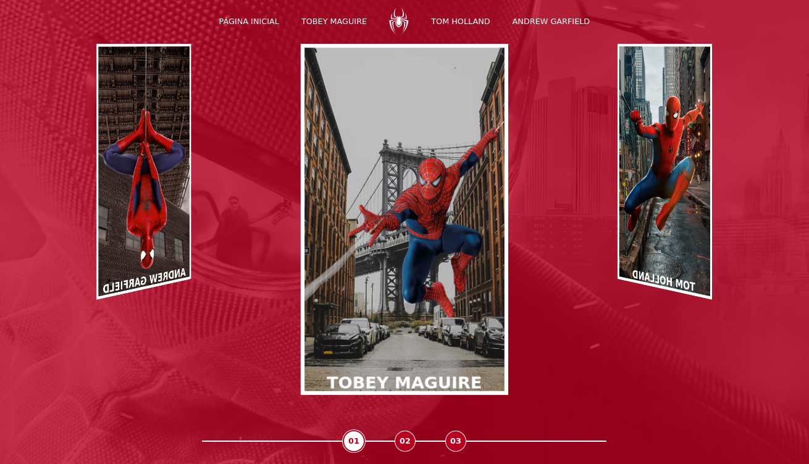

## Screenshots

# Spider-Man Multiverses

O site apresenta informações sobre os três atores que interpretaram o personagem Spider-Man nos filmes da Marvel.

## Estrutura do Site

- Página Inicial: A página inicial apresenta uma imagem de fundo e links para as páginas das três versões de Spider-Man.
- Páginas de Ator: As páginas de ator (Tobey Maguire, Tom Holland e Andrew Garfield) apresentam informações sobre cada um deles, incluindo imagens e links para os filmes que eles interpretaram como Spider-Man.

## Tecnologias Utilizadas
- HTML
- CSS
- JavaScript

## Contribuir para o Projeto

Obrigado por considerar contribuir para o site do Spider-Man! Para contribuir, siga os seguintes passos:

1.  Crie uma nova branch com '**git checkout -b nome-da-branch**'.
2.  Faça as alterações necessárias.
3.  Confirme as alterações com '**git add**'.
4.  Envia a commit usando '**git commit -m "mensagem-da-commmit**'.
5.  Crie um pull request no GitHub/ GitLab.
